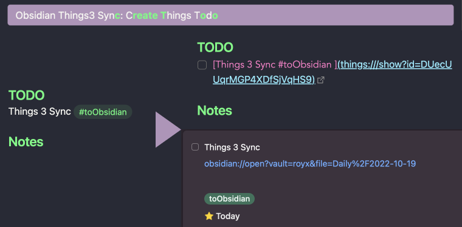

# Obsidian Things3 Sync
A Plugin for syncing between Obsidian and Things3. Supporting with Multi Language, Tags and Date, Cross-Platform. 
## Features

* Support Mac OS and iOS.
* Support **Multiple Language** when creating todo.
* Support **Todo Tags**. You can just add tags after todo, or add default tags in setting.
* Support **Capture Date**, if you the file has a Date in it, it will capture the date when create the todo.

## Usage

### Create Todo

* Select the line of todo

* Using `cmd + p` and run the `Things3 Sync: Create Todo`

* ***Tags***: for now, the tags only support Things exsited tags. So add tag in Things3 first, and then use this plugin.

### Toggle Todo

* Select the line of todo

* Using `cmd + P` and run the `Things3 Sync: Toggle Todo`

* The Todo will be toggled both in Obsidian and Things3

***Notes:*** If you wanna use the command conveniently, it would be better to set up a hotkeys for it.

## Roadmap

- [x] Multiple Markdown elements support.

- [x] Permanent URL support.

- [x] Better tags support.

- [ ] ~~Better toggle trigger method.~~

- [ ] Multi-line support.

## Security

This plugin require your Things 3 Auth Token for sync Todo status. The token will be locally saved in your vault obsidian folder(./obsidian/plugins). So be carefully not to share the folder directly to anyone else, incase they got your token.

## Feedback & Request

Any feedback or request, please submit a issue here ;)
Thanks a lot.

## Attribution
These following repos offered great help during development:
* [Todoist Text](https://github.com/wesmoncrief/obsidian-todoist-text)
* [Things Link](https://github.com/gavinmn/obsidian-things-link)

## Buy me a coffee

