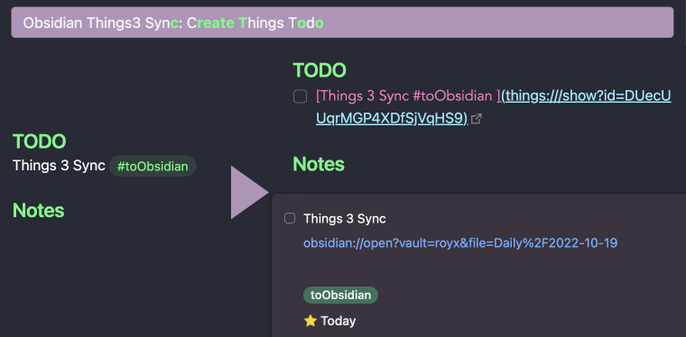

# Things3 Sync
A cross-platform Obsidian plugin for syncing todos (as well as tags, dates) between Obsidian and Things3 (with multi-language support).
## Features

* **Cross-Platform**: Works on both macOS and iOS
* **Multiple Languages**: Use any language when creating todos
* **Todo Tags**: You can enter tags after your todo text, or via the default tags in the settings
* **Date Capture**: If the Obsidian note includes a date, it will be included when creating the todo in Things3.

## How It Works (and What It Doesn't)

This plugin is **one-way**: you push changes *from* Obsidian *to* Things3. Things3's URL scheme doesn't allow listening for changes, so:

* ✅ Creating a todo and toggling its status are triggered from Obsidian, per line.
* ✅ Toggling status updates **both** Obsidian and Things3.
* ❌ Completing or editing a task **in Things3 does not update Obsidian** — there is no automatic sync back.
* ℹ️ Only the title, tags, and done/not-done state are synced. Tags must already exist in Things3 (see the note under *Creating A Todo*).
* ℹ️ *Creating a Todo from a Note* adds a backlink to your note inside the Things3 todo, but does **not** modify the Obsidian note itself.

## Usage

### Creating A Todo

* Select the line of the todo

* Using `cmd + p` and run the `Things3 Sync: Create Todo`

* ***Note:*** The tags feature currently only supports tags that already exist in Things3. To add a new tag, you'll need to first create it in Things3, and then you will be able to use it in this plugin.

### Toggling a Todo's Status

* Select the line of the todo

* Using `cmd + P` and run the `Things3 Sync: Toggle Todo`

* The status of the todo will be toggled in both Obsidian and Things3

***Pro Tip:*** This feature can be assigned a hotkey for faster, more convenient toggling.

### Creating a Todo from a Note

You can create a Things3 todo from an Obsidian note. This plugin will automatically include a backlink to the Obisidian note in the todo in Things3

## Roadmap

- [x] Multiple Markdown elements support.

- [x] Permanent URL support.

- [x] Better tags support.

- [ ] ~~Better toggle trigger method.~~ Not (currently) possible due to a limitation in the Things3 API

- [ ] ~~Multi-line support.~~ Not (currently) possible due to a communication limitation between Things3 and Obsidian

- [x] Obsidian Note to Things3 Todo

## Security

This plugin requires an authentication token from Things3 in order to sync data between Obsidian and Things3. That auth token will be stored in plain-text inside your Obsidian vault's plugin folder (e.g., `./obsidian/plugins/obsidian-things3-sync`). As a result, you should be cautious when syncing or sharing the settings for this plugin.

## Feature Requests/Feedback

Both feature requests and feedback are welcome. Please feel free to submit an issue for either ;)

Thanks a lot.

## Attribution
The folliwng repositories offered great help during the development of this plugin:
* [Todoist Text](https://github.com/wesmoncrief/obsidian-todoist-text)
* [Things Link](https://github.com/gavinmn/obsidian-things-link)

## Buy me a coffee

